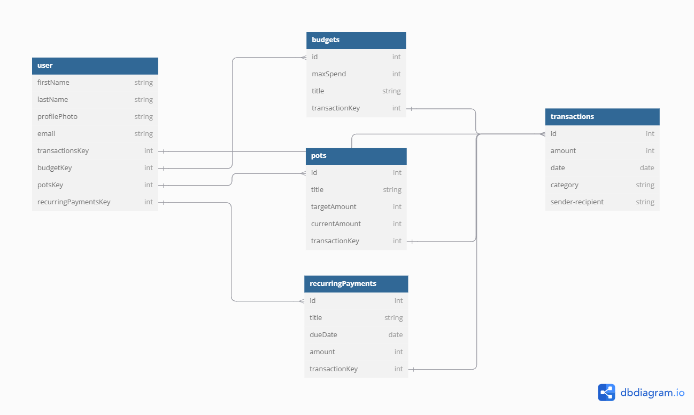

# Finance App Documentation

## Database Schema Design



## Project Design

[View Project Design on Figma](https://www.figma.com/design/mTujbr5G6MOVcWuJmf4wAL/personal-finance-app?node-id=101-2&t=hXbsXGEFtEFTwtLA-1)

## API Documentation

### User Authentication/Authorization

#### All Endpoints that Require Authentication

Endpoints requiring the user to be logged in:

- **Request**: Any endpoint requiring authentication.
- **Error Response: Require Authentication**
  - **Status Code**: `401`
  - **Headers**:
    - `Content-Type: application/json`
  - **Body**:
    ```json
    {
      "message": "Authentication required"
    }
    ```

#### All Endpoints that Require Proper Authorization

Endpoints requiring authentication where the user does not have the correct permissions:

- **Request**: Any endpoint requiring proper authorization.
- **Error Response: Require Proper Authorization**
  - **Status Code**: `403`
  - **Headers**:
    - `Content-Type: application/json`
  - **Body**:
    ```json
    {
      "message": "Forbidden"
    }
    ```

### Endpoints

#### Get the Current User

Returns information about the currently logged-in user.

- **Require Authentication**: `true`
- **Request**:
  - **Method**: `GET`
  - **Route**: `/api/currentUser`
  - **Body**: None
- **Successful Response (User is Logged In)**:
  - **Status Code**: `200`
  - **Headers**:
    - `Content-Type: application/json`
  - **Body**:
    ```json
    {
      "user": {
        "id": 1,
        "firstName": "John",
        "lastName": "Smith",
        "email": "john.smith@gmail.com",
        "profilePhoto": "photoUrl.com",
        "username": "JohnSmith",
        "budgets": [],
        "pots": [],
        "recurringPayments": [],
        "transactions": []
      }
    }
    ```
- **Successful Response (No User Logged In)**:
  - **Status Code**: `200`
  - **Headers**:
    - `Content-Type: application/json`
  - **Body**:
    ```json
    {
      "user": null
    }
    ```

#### Log In a User

Authenticates a user with valid credentials and returns their information.

- **Require Authentication**: `false`
- **Request**:
  - **Method**: `POST`
  - **Route**: `/api/login`
  - **Headers**:
    - `Content-Type: application/json`
  - **Body**:
    ```json
    {
      "credential": "john.smith@gmail.com",
      "password": "secret password"
    }
    ```
- **Successful Response**:
  - **Status Code**: `200`
  - **Headers**:
    - `Content-Type: application/json`
  - **Body**:
    ```json
    {
      "user": {
        "id": 1,
        "firstName": "John",
        "lastName": "Smith",
        "email": "john.smith@gmail.com",
        "profilePhoto": "photoUrl.com",
        "username": "JohnSmith",
        "budgets": [],
        "pots": [],
        "recurringPayments": [],
        "transactions": []
      }
    }
    ```
- **Error Response (Invalid Credentials)**:
  - **Status Code**: `401`
  - **Headers**:
    - `Content-Type: application/json`
  - **Body**:
    ```json
    {
      "message": "Invalid credentials"
    }
    ```
- **Error Response (Body Validation Errors)**:
  - **Status Code**: `400`
  - **Headers**:
    - `Content-Type: application/json`
  - **Body**:
    ```json
    {
      "message": "Bad Request",
      "errors": {
        "credential": "Email or username is required",
        "password": "Password is required"
      }
    }
    ```

#### Sign Up a User

Creates a new user, logs them in, and returns their information.

- **Require Authentication**: `false`
- **Request**:
  - **Method**: `POST`
  - **Route**: `/api/users`
  - **Headers**:
    - `Content-Type: application/json`
  - **Body**:
    ```json
    {
      "firstName": "John",
      "lastName": "Smith",
      "profilePhoto": "photoUrl.com",
      "email": "john.smith@gmail.com",
      "username": "JohnSmith",
      "password": "secret password"
    }
    ```
- **Successful Response**:
  - **Status Code**: `201`
  - **Headers**:
    - `Content-Type: application/json`
  - **Body**:
    ```json
    {
      "user": {
        "id": 1,
        "firstName": "John",
        "lastName": "Smith",
        "profilePhoto": "photoUrl.com",
        "email": "john.smith@gmail.com",
        "username": "JohnSmith",
        "budgets": [],
        "pots": [],
        "recurringPayments": [],
        "transactions": []
      }
    }
    ```
- **Error Response (User Already Exists)**:
  - **Status Code**: `500`
  - **Headers**:
    - `Content-Type: application/json`
  - **Body**:
    ```json
    {
      "message": "User already exists",
      "errors": {
        "email": "User with that email already exists",
        "username": "User with that username already exists"
      }
    }
    ```
- **Error Response (Body Validation Errors)**:
  - **Status Code**: `400`
  - **Headers**:
    - `Content-Type: application/json`
  - **Body**:
    ```json
    {
      "message": "Bad Request",
      "errors": {
        "email": "Invalid email",
        "username": "Username is required",
        "firstName": "First Name is required",
        "lastName": "Last Name is required"
      }
    }
    ```

## Transactions API Documentation

### Get All Transactions

**Description:** Returns all the transactions for a specific user.

- **Require Authentication:** Yes

**Request:**

- **Method:** `GET`
- **Route path:** `/api/:userId/transactions`
- **Body:** None

**Successful Response:**

- **Status Code:** `200`
- **Headers:**
  - `Content-Type: application/json`
- **Body:**

```json
{
  "transactions": [
    {
      "id": 1,
      "amount": 20.0,
      "isExpense": false,
      "budgetId": 1,
      "potsId": null,
      "date": "2024-01-19",
      "category": "Electric",
      "recipient-sender": "Chase Bank"
    }
  ]
}
```

---

### Get Details of a Transaction by ID

**Description:** Returns the details of a specific transaction.

- **Require Authentication:** Yes

**Request:**

- **Method:** `GET`
- **Route path:** `/api/transactions/:transactionId`
- **Body:** None

**Successful Response:**

- **Status Code:** `200`
- **Headers:**
  - `Content-Type: application/json`
- **Body:**

```json
{
  "id": 1,
  "amount": 20.0,
  "isExpense": false,
  "budgetId": 1,
  "potsId": null,
  "date": "2024-01-19",
  "category": "Electric",
  "recipient-sender": "Chase Bank"
}
```

**Error Response:** Transaction not found

- **Status Code:** `404`
- **Headers:**
  - `Content-Type: application/json`
- **Body:**

```json
{
  "message": "Transaction couldn't be found"
}
```

---

### Create a Transaction

**Description:** Creates a new transaction and returns it.

- **Require Authentication:** Yes

**Request:**

- **Method:** `POST`
- **Route path:** `/api/transaction`
- **Headers:**
  - `Content-Type: application/json`
- **Body:**

```json
{
  "amount": 20.0,
  "isExpense": false,
  "budgetId": 1,
  "date": "2024-01-19",
  "category": "Electric",
  "recipient-sender": "Chase Bank"
}
```

**Successful Response:**

- **Status Code:** `201`
- **Headers:**
  - `Content-Type: application/json`
- **Body:**

```json
{
  "id": 1,
  "amount": 20.0,
  "isExpense": false,
  "budgetId": 1,
  "potsId": null,
  "date": "2024-01-19",
  "category": "Electric",
  "recipient-sender": "Chase Bank",
  "createdAt": "2021-11-19 20:39:36",
  "updatedAt": "2021-11-19 20:39:36"
}
```

**Error Response:** Validation errors

- **Status Code:** `400`
- **Headers:**
  - `Content-Type: application/json`
- **Body:**

```json
{
  "message": "Bad Request",
  "errors": {
    "amount": "Amount is required",
    "isExpense": "Expense is required",
    "date": "Date is required",
    "category": "Category is required",
    "recipient-sender": "Sender or Recipient is required"
  }
}
```

---

### Edit a Transaction

**Description:** Updates an existing transaction and returns it.

- **Require Authentication:** Yes
- **Require Proper Authorization:** The transaction must belong to the current user.

**Request:**

- **Method:** `PUT`
- **Route path:** `/api/transaction/:transactionId`
- **Headers:**
  - `Content-Type: application/json`
- **Body:**

```json
{
  "amount": 20.0,
  "isExpense": false,
  "budgetId": 1,
  "potsId": null,
  "date": "2024-01-19",
  "category": "Electric",
  "recipient-sender": "Chase Bank"
}
```

**Successful Response:**

- **Status Code:** `200`
- **Headers:**
  - `Content-Type: application/json`
- **Body:**

```json
{
  "id": 1,
  "amount": 20.0,
  "isExpense": false,
  "budgetId": 1,
  "date": "2024-01-19",
  "category": "Electric",
  "recipient-sender": "Chase Bank",
  "createdAt": "2021-11-19 20:39:36",
  "updatedAt": "2021-11-19 20:39:36"
}
```

**Error Response:** Validation errors

- **Status Code:** `400`
- **Headers:**
  - `Content-Type: application/json`
- **Body:**

```json
{
  "message": "Bad Request",
  "errors": {
    "amount": "Amount is required",
    "isExpense": "Expense is required",
    "date": "Date is required",
    "category": "Category is required",
    "recipient-sender": "Sender or Recipient is required"
  }
}
```

**Error Response:** Transaction not found

- **Status Code:** `404`
- **Headers:**
  - `Content-Type: application/json`
- **Body:**

```json
{
  "message": "Transaction couldn't be found"
}
```

---

### Delete a Transaction

**Description:** Deletes an existing transaction.

- **Require Authentication:** Yes
- **Require Proper Authorization:** The transaction must belong to the current user.

**Request:**

- **Method:** `DELETE`
- **Route path:** `/api/transaction/:transactionId`
- **Body:** None

**Successful Response:**

- **Status Code:** `200`
- **Headers:**
  - `Content-Type: application/json`
- **Body:**

```json
{
  "message": "Successfully deleted"
}
```

**Error Response:** Transaction not found

- **Status Code:** `404`
- **Headers:**
  - `Content-Type: application/json`
- **Body:**

```json
{
  "message": "Transaction couldn't be found"
}
```

## BUDGETS

### Get All Budgets of the Current User

Returns all the budgets written by the current user.

- **Require Authentication**: true
- **Request**

  - **Method**: GET
  - **Route Path**: `/api/:userId/budget`
  - **Body**: none

- **Successful Response**
  - **Status Code**: 200
  - **Headers**:
    - Content-Type: application/json
  - **Body**:
    ```json
    {
      "Budgets": [
        {
          "id": 1,
          "maxSpend": 2000,
          "title": "Eating Out",
          "transactions": [
            {
              "id": 1,
              "amount": 20.0,
              "isExpense": false,
              "budgetId": 1,
              "date": "2024-01-19",
              "category": "Electric",
              "recipientSender": "Chase Bank"
            }
          ]
        }
      ]
    }
    ```

---

### Create a Budget

Create and return a new budget.

- **Require Authentication**: true
- **Request**

  - **Method**: POST
  - **Route Path**: `/api/budget`
  - **Headers**:
    - Content-Type: application/json
  - **Body**:
    ```json
    {
      "maxSpend": 2000,
      "title": "Eating Out"
    }
    ```

- **Successful Response**

  - **Status Code**: 201
  - **Headers**:
    - Content-Type: application/json
  - **Body**:
    ```json
    {
      "id": 1,
      "maxSpend": 2000,
      "title": "Eating Out",
      "transactions": [],
      "createdAt": "2021-11-19T20:39:36Z",
      "updatedAt": "2021-11-19T20:39:36Z"
    }
    ```

- **Error Response: Body Validation Errors**

  - **Status Code**: 400
  - **Headers**:
    - Content-Type: application/json
  - **Body**:
    ```json
    {
      "message": "Bad Request",
      "errors": {
        "transaction": {
          "maxSpend": "Max Spend is required",
          "title": "Title must not be empty"
        }
      }
    }
    ```

- **Error Response: Couldn't Find a Budget with the Specified ID**
  - **Status Code**: 404
  - **Headers**:
    - Content-Type: application/json
  - **Body**:
    ```json
    {
      "message": "Budget couldn't be found"
    }
    ```

---

### Edit a Budget

Update and return an existing budget.

- **Require Authentication**: true
- **Require Proper Authorization**: Budget must belong to the current user
- **Request**

  - **Method**: PUT
  - **Route Path**: `/api/budget/:budgetId`
  - **Headers**:
    - Content-Type: application/json
  - **Body**:
    ```json
    {
      "maxSpend": 2000,
      "title": "Eating Out",
      "transactions": [
        {
          "id": 1,
          "amount": 20.0,
          "isExpense": false,
          "budgetId": 1,
          "date": "2024-01-19",
          "category": "Electric",
          "recipientSender": "Chase Bank"
        }
      ]
    }
    ```

- **Successful Response**

  - **Status Code**: 200
  - **Headers**:
    - Content-Type: application/json
  - **Body**:
    ```json
    {
      "id": 1,
      "maxSpend": 2000,
      "title": "Eating Out",
      "transactions": [
        {
          "id": 1,
          "amount": 20.0,
          "isExpense": false,
          "budgetId": 1,
          "date": "2024-01-19",
          "category": "Electric",
          "recipientSender": "Chase Bank"
        }
      ],
      "createdAt": "2021-11-19T20:39:36Z",
      "updatedAt": "2021-11-19T20:39:36Z"
    }
    ```

- **Error Response: Body Validation Errors**

  - **Status Code**: 400
  - **Headers**:
    - Content-Type: application/json
  - **Body**:
    ```json
    {
      "message": "Bad Request",
      "errors": {
        "title": "Title is required",
        "maxSpend": "Max Spend must be a positive number"
      }
    }
    ```

- **Error Response: Couldn't Find a Budget with the Specified ID**
  - **Status Code**: 404
  - **Headers**:
    - Content-Type: application/json
  - **Body**:
    ```json
    {
      "message": "Budget couldn't be found"
    }
    ```

---

### Delete a Budget

Delete an existing budget.

- **Require Authentication**: true
- **Require Proper Authorization**: Budget must belong to the current user
- **Request**

  - **Method**: DELETE
  - **Route Path**: `/api/budget/:budgetId`
  - **Body**: none

- **Successful Response**

  - **Status Code**: 200
  - **Headers**:
    - Content-Type: application/json
  - **Body**:
    ```json
    {
      "message": "Successfully deleted"
    }
    ```

- **Error Response: Couldn't Find a Budget with the Specified ID**
  - **Status Code**: 404
  - **Headers**:
    - Content-Type: application/json
  - **Body**:
    ```json
    {
      "message": "Budget couldn't be found"
    }
    ```

## Pots

### Get all of the Current User's Pots

Return all the Pots that the current user has made.

- Require Authentication: true
- Request

  - Method: GET
  - Route path: api/:userId/pots/
  - Body: none

- Successful Response

  - Status Code: 200
  - Headers:
    - Content-Type: application/json
  - Body:

    ```json
    {
      "Pots": [
        {
          "id": 1,
          "title": "Savings",
          "targetAmount": 2000,
          "transactions": [
            {
              "id": 1,
              "amount": 100.0,
              "isExpense": false,
              "potId": 1,
              "date": "2024-01-19",
              "category": "SAVINGS",
              "recipient-sender": "Chase Bank"
            }
          ],
          "createdAt": "2021-11-19 20:39:36",
          "updatedAt": "2021-11-19 20:39:36"
        }
      ]
    }
    ```

### Create a Pot

Create and return a new pot.

- Require Authentication: true
- Request

  - Method: POST
  - Route path: /api/pots/
  - Headers:
    - Content-Type: application/json
  - Body:

    ```json
    {
      "targetAmount": 2000,
      "title": "Savings",
      "transactions": [],
      "createdAt": "2021-11-19 20:39:36",
      "updatedAt": "2021-11-19 20:39:36"
    }
    ```

- Successful Response

  - Status Code: 201
  - Headers:
    - Content-Type: application/json
  - Body:

    ```json
    {
      "id": 1,
      "targetAmount": 2000,
      "title": "Savings",
      "transactions": [],
      "createdAt": "2021-11-19 20:39:36",
      "updatedAt": "2021-11-19 20:39:36"
    }
    ```

- Error response: Body validation errors

  - Status Code: 400
  - Headers:
    - Content-Type: application/json
  - Body:

    ```json
    {
      "message": "Bad Request",
      "errors": {
        "targetAmount": "targetAmount cannot be in the negative",
        "title": "title cannot be empty"
      }
    }
    ```

### Edit a Pot

Update and return an existing pot.

- Require Authentication: true
- Require proper authorization: pot must belong to the current user
- Request

  - Method: PUT
  - Route path: /api/pots/:potId
  - Headers:
    - Content-Type: application/json
  - Body:

    ```json
    {
      "targetAmount": 2000,
      "title": "Savings",
      "transactions": [
        {
          "id": 1,
          "amount": 1000.0,
          "isExpense": false,
          "potId": 1,
          "date": "2024-01-19",
          "category": "SAVINGS",
          "recipient-sender": "Chase Bank"
        }
      ]
    }
    ```

- Successful Response

  - Status Code: 200
  - Headers:
    - Content-Type: application/json
  - Body:

    ```json
    {
      "id": 1,
      "targetAmount": 2000,
      "title": "Savings",
      "transactions": [
        {
          "id": 1,
          "amount": 1000.0,
          "isExpense": false,
          "potId": 1,
          "date": "2024-01-19",
          "category": "SAVINGS",
          "recipient-sender": "Chase Bank"
        }
      ],
      "createdAt": "2021-11-19 20:39:36",
      "updatedAt": "2021-11-20 10:06:40"
    }
    ```

- Error response: Body validation errors

  - Status Code: 400
  - Headers:
    - Content-Type: application/json
  - Body:

    ```json
    {
      "message": "Bad Request",
      "errors": {
        "targetAmount": "targetAmount cannot be in the negative",
        "title": "title cannot be empty"
      }
    }
    ```

- Error response: Couldn't find a Pot with the specified id

  - Status Code: 404
  - Headers:
    - Content-Type: application/json
  - Body:

    ```json
    {
      "message": "Pot couldn't be found"
    }
    ```

### Delete a Pot

Delete an existing Pot.

- Require Authentication: true
- Require proper authorization: Pot must belong to the current user
- Request

  - Method: DELETE
  - Route path: /api/pots/:potId
  - Body: none

- Successful Response

  - Status Code: 200
  - Headers:
    - Content-Type: application/json
  - Body:

    ```json
    {
      "message": "Successfully deleted"
    }
    ```

- Error response: Couldn't find a Pot with the specified id

  - Status Code: 404
  - Headers:
    - Content-Type: application/json
  - Body:

    ```json
    {
      "message": "Pot couldn't be found"
    }
    ```

## Recurring Payments

### Get all of the Current User's recurring payments

Return all the recurring payments that the current user has made.

- Require Authentication: true
- Request

  - Method: GET
  - Route path: api/:userId/recurring_payments/
  - Body: none

- Successful Response

  - Status Code: 200
  - Headers:
    - Content-Type: application/json
  - Body:
    ```json
    {
      "recurring_payments": [
        {
          "id": 1,
          "title": "Rent",
          "frequency": "monthly",
          "dueDate": "2021-11-19",
          "amount": 200,
          "createdAt": "2021-11-19 20:39:36",
          "updatedAt": "2021-11-19 20:39:36"
        }
      ]
    }
    ```

### Create a Recurring Payment

Create and return a new recurring payment.

- Require Authentication: true
- Request

  - Method: POST
  - Route path: /api/recurring_payments/
  - Headers:
    - Content-Type: application/json
  - Body:
    ```json
    {
      "title": "Rent",
      "frequency": "monthly",
      "dueDate": "2021-11-19",
      "amount": 200
    }
    ```

- Successful Response

  - Status Code: 201
  - Headers:
    - Content-Type: application/json
  - Body:
    ```json
    {
      "id": 1,
      "title": "Rent",
      "frequency": "monthly",
      "dueDate": "2021-11-19",
      "amount": 200,
      "createdAt": "2021-11-19T20:39:36.000Z",
      "updatedAt": "2021-11-19T20:39:36.000Z"
    }
    ```

- Error response: Body validation errors

  - Status Code: 400
  - Headers:
    - Content-Type: application/json
  - Body:
    ```json
    {
      "message": "Bad Request",
      "errors": {
        "title": "Title is required",
        "frequency": "Frequency must be one of 'monthly', 'weekly', 'daily', or 'yearly'",
        "dueDate": "Due date must be in the format YYYY-MM-DD",
        "amount": "Amount must be a positive number"
      }
    }
    ```

### Edit a Recurring Payment

Update and return an existing recurring payment.

- Require Authentication: true
- Require proper authorization: recurring payment must belong to the current user
- Request

  - Method: PUT
  - Route path: /api/recurring_payments/:paymentId
  - Headers:
    - Content-Type: application/json
  - Body:
    ```json
    {
      "title": "Rent",
      "frequency": "monthly",
      "dueDate": "2021-11-19",
      "amount": 200
    }
    ```

- Successful Response

  - Status Code: 200
  - Headers:
    - Content-Type: application/json
  - Body:
    ```json
    {
      "id": 1,
      "title": "Rent",
      "frequency": "monthly",
      "dueDate": "2021-11-19",
      "amount": 200,
      "createdAt": "2021-11-19T20:39:36.000Z",
      "updatedAt": "2021-11-20T10:06:40.000Z"
    }
    ```

- Error response: Body validation errors

  - Status Code: 400
  - Headers:
    - Content-Type: application/json
  - Body:
    ```json
    {
      "message": "Bad Request",
      "errors": {
        "title": "Title is required",
        "frequency": "Frequency must be one of 'monthly', 'weekly', 'daily', or 'yearly'",
        "dueDate": "Due date must be in the format YYYY-MM-DD",
        "amount": "Amount must be a positive number"
      }
    }
    ```

- Error response: Couldn't find a recurring payment with the specified id

  - Status Code: 404
  - Headers:
    - Content-Type: application/json
  - Body:
    ```json
    {
      "message": "Recurring payment couldn't be found"
    }
    ```

### Delete a Recurring Payment

Delete an existing recurring payment.

- Require Authentication: true
- Require proper authorization: recurring payment must belong to the current user
- Request

  - Method: DELETE
  - Route path: /api/recurring_payments/:paymentId
  - Body: none

- Successful Response

  - Status Code: 200
  - Headers:
    - Content-Type: application/json
  - Body:
    ```json
    {
      "message": "Successfully deleted"
    }
    ```

- Error response: Couldn't find a recurring payment with the specified id

  - Status Code: 404
  - Headers:
    - Content-Type: application/json
  - Body:
    ```json
    {
      "message": "Recurring payment couldn't be found"
    }
    ```
